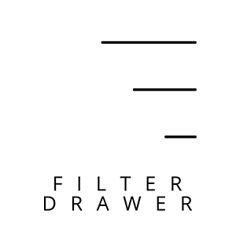
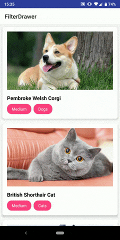

<p align="center"></p>

<p align="center">
    <a href="https://bintray.com/camerash/maven/filterdrawer/_latestVersion"></a>
    <a href="https://travis-ci.org/Camerash/FilterDrawer"></a>
    <a href="https://android-arsenal.com/api?level=16"></a>
	<a href="https://opensource.org/licenses/MIT"></a>
</p>

<p align="center"><b>Android plug-and-play filter that slides</b></p>

## Sample

The sample app is under `app` directory




## Features

- **Plug-and-play -** Adapt default implementations with your own filters and you are good to go
- **Independent -** Set everything up without modifying your activity's layout file
- **Customizable -** Extend base class implementations and take control of everything
- **Versatile -** Create your own filters for literally anything
- **Built-in adapter -** So you don't need to worry about the filtering logic for your recycler view


## Usage

We will use the implementation in the sample project as examples.


### 1. Extend

Create classes that extends `DefaultParnetItem` and `DefaultChildItem`.

These are the classes used to control and configure items in the FilterDrawer.

#### Default Parent Item  

`ParentItem` serves as the controller for the categories you see in the Filter Drawer.

The default behaviour has already been implemented for you in the class `DefaultParentItem`

You need to implement the following required abstract methods when extending the class:

```kotlin
// Required methods
override fun getParentIcon(): Int
override fun getParentTitle(): String
override fun getChildCollection(): List<ChildItem>
override fun allowSelectMultiple(): Boolean

// Optional modifiers
override fun getLayoutRes(): Int
override fun getRootLinearLayoutId(): Int
override fun getToggleExpandOnClickViewId(): Int
override fun getViewHolder(v: View): ViewHolder
override fun getDefaultTextColorRes(): Int
override fun getSelectedTextColorRes(): Int
override fun getDefaultIconColorRes(): Int
override fun getSelectedIconColorRes(): Int
```

The parent class in our pet sample app, namely `PetFilterCategory`, has the following implementation:

```kotlin
class PetFilterCategory(val type: FilterType, @DrawableRes val icon: Int, private val childList: List<PetFilter>): DefaultParentItem() {

    enum class FilterType { Kind, Size }

    override fun getParentIcon(): Int = this.icon

    override fun getParentTitle(): String = this.type.name

    override fun getChildCollection(): List<ChildItem> = this.childList

    override fun getSelectedTextColorRes(): Int = R.color.colorPrimary

    override fun allowSelectMultiple(): Boolean = true
}
```

In the above example, the `type`, `icon` and the category's child filters in `childList` are initialized in the class's constructor.

Note that the method `getChildCollection()` requires a `List` of `ChildItem`. Here we have also defined our own class that extends `ChildItem` , called `PetFilter`, which will be explained below.


 #### Default Child Item 

`ChildItem` serves as the controller for the filters you see under every categories in the Filter Drawer.

The default behaviour has already been implemented for you in the class `DefaultChildItem`

You need to implement the following required abstract methods when extending the class:

```kotlin
// Required methods
override fun getTitle(): String
override fun getSelectedColorRes(): Int

// Optional modifiers
override fun getLayoutRes(): Int
override fun getViewHolder(v: View): ViewHolder
override fun getDefaultTextColorRes(): Int
override fun getSelectedTextColorRes(): Int
override fun getDefaultBackgroundColorRes(): Int
override fun getSelectedBackgroundColorRes(): Int
```

The child class in our pet sample app, namely `PetFilter`, has the following implementation:

```kotlin
class PetFilter(val filter: Enum<*>) : DefaultChildItem() {

    enum class Kind { Cats, Dogs, Rabbits, Hamsters, Birds }
    
    enum class Size { Small, Medium, Large }

    override fun getTitle(): String = this.filter.name

    override fun getSelectedTextColorRes(): Int = R.color.colorPrimary
}
```

As we have two types of filters, `Kind` and `Size`, we defined the suitable enum classes and instantiate`PetFilter` with an `Enum` called `filter`, which serves as the filter's identification.


### 2. Build

After finishing the above parent and child classes, we can build the filter using `DrawerBuilder`.

`DrawerBuilder` requires two types to instantiate, which each extends `ParentItem` and `ChildItem` respectively.

For our example, we first construct our filter list:

```kotlin
 private fun constructFilterItems(): ArrayList<PetFilterCategory> {

     val pet = PetFilterCategory(PetFilterCategory.FilterType.Kind, R.drawable.round_pets_24, PetFilter.Kind.values().map { PetFilter(it) })

     val animal = PetFilterCategory(PetFilterCategory.FilterType.Size, R.drawable.round_size_24, PetFilter.Size.values().map { PetFilter(it) })

     return arrayListOf(pet, animal)
 }
```

Then construct our `FilterDrawer` in the `onCreate` method of your activity:

```kotlin
val filterDrawer = DrawerBuilder<PetFilterCategory, PetFilter>(this)
                    .displayToolbar(true)
                    .withItems(constructFilterItems())
                    .build()
```

This builds our `FilterDrawer` and automatically adds it to the activity.

Up to this point, you should be able to run your app and check out the `FilterDrawer` by swiping from the right of the screen.


### 3. Filter

Our filter is ready, but there are yet to have things to be filtered.

Let's create a class named `Pet`. To utilize the built-in `FilterableRecyclerAdapter` later on, we need to implement the `DiffItemCallback<T>` interface as follows:

```kotlin
class Pet(val name: String, val imageUrl: String, val kind: PetFilter.Kind, val size: PetFilter.Size) : DiffItemCallback<Pet> {
    override fun isIdentical(item: Pet): Boolean {
        return name == item.name
    }

    override fun hasSameRepresentation(item: Pet): Boolean {
        return imageUrl == item.imageUrl
    }
}
```

`isIdentical` provides information on whether the two items *are identical at a data level*. You should compare IDs or item-specific variables here.

`hasSameRepresentation` provides information on whether the two items *looks the same* when shown to users. You should compare resources shown to users here.

The built-in adapter compare items by using the platform-provided`DiffUtil.Callback()`, where our `isIdentical` interface is called in its `areItemsTheSame` method, and `hasSameRepresentation` is called in its `areContentsTheSame` method.

For more informations, check out the library's source code, or [the official documentation on DiffUtil](https://developer.android.com/reference/android/support/v7/util/DiffUtil.Callback).


Next, let's create our adapter by extending the built-in `FilterableRecyclerAdapter`. The adapter looks more or less the same with a typical recycler adapter, with the exception of the method `filter` which you will need to implement.

In out example, the implementation of method `filter` would look like this:

```kotlin
override fun filter(data: Pet, parent: PetFilterCategory, child: PetFilter): Boolean {
    return child.filter == when (parent.type) {
        PetFilterCategory.FilterType.Kind -> data.kind
        PetFilterCategory.FilterType.Size -> data.size
    }
}
```

`filter` will get called whenever the filters in `FilterDrawer` is updated. In the code above, it returns whether the given `Pet` matches the given `PetFilter` under certain `PetFilterCategory`.

All nested checkings are done under the hood, so all we need to worry about is whether the given `Pet` matches the *single* given `PetFilter`.


Finally, setup the your `RecyclerView` with our adapter, and pass a reference of our `FilterDrawer` to the adapter by:

```kotlin
adapter.bindFilterDrawer(filterDrawer)
```

and you are all set!


## Customization

Please refer to the [KDoc here](https://camerash.github.io/FilterDrawer/KDoc) to familiarize yourself with the base implementations.

Follow the default implementation to extend `ParentItem` and `ChildItem` would also be a good start for your customization.


## API

[Please refer to the KDoc here](https://camerash.github.io/FilterDrawer/KDoc)


## Library used

- [Materialize](https://github.com/mikepenz/Materialize) by [Mike Penz](https://github.com/mikepenz)
- [ExpandableLayout](https://github.com/cachapa/ExpandableLayout) by [Daniel Cachapa](https://github.com/cachapa)


## Contribution

Feel free to open issues if there are any suggestions or bugs.

Contribution by opening pull requests are also welcomed!


## Developed By

- Esmond Wong (Camerash)
- esmond9981127@gmail.com
- paypal.me/camerash](https://www.paypal.me/camerash)


## License
MIT © [Camerash](https://github.com/Camerash)